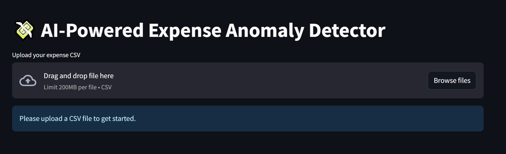
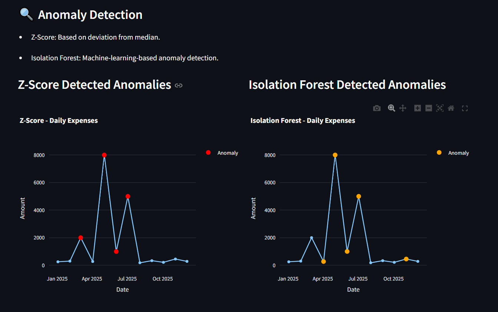
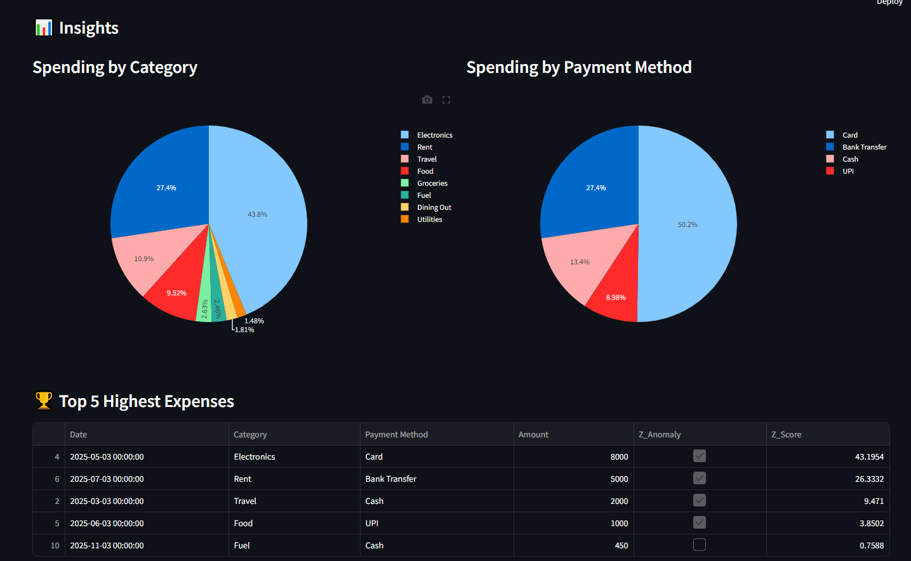
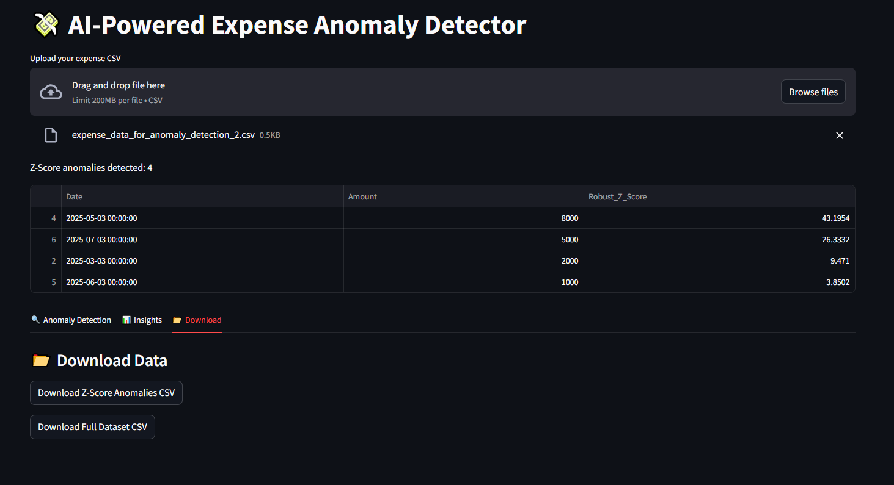

# 💸 AI-Powered Expense Anomaly Detector

This project is a **Streamlit-based interactive web app** that helps users detect **anomalies in their expense data** using two powerful techniques:
- 📏 **Robust Z-Score (Statistical Method)**
- 🌲 **Isolation Forest (Machine Learning)**

It supports filtering by **month**, **category**, and adjusting **anomaly thresholds**, and displays results with clean, insightful visualizations.

---
## 🖼️ App Preview

Here are some screenshots from the app in action:

### 🔹 Home Page & File Upload


### 🔹 Anomaly Detection Using Robust Z-Score


### 🔹 Isolation Forest-Based Detection


### 🔹 Filter by Category and Month


### 🔹 Export Analyzed Results


---+
## 🚀 Features

- 📊 Upload your expense CSV
- 📅 Filter by date and category
- ⚠️ Detect anomalies using:
  - **Robust Z-Score** (median + MAD based)
  - **Isolation Forest** (unsupervised ML)
- 📈 Interactive charts for insights
- 📥 Download cleaned and flagged data as CSV

---

## 📁 Sample Dataset Format

| Date       | Category       | Payment Method | Amount |
|------------|----------------|----------------|--------|
| 01-03-2025 | Food           | UPI            | 250    |
| 05-03-2025 | Electronics    | Card           | 8000   |
| 07-03-2025 | Rent           | Bank Transfer  | 5000   |

> Ensure date format is `DD-MM-YYYY`.

---

## 🧠 How It Works

### 🔹 Robust Z-Score

A **statistical method** based on **median** and **MAD (Median Absolute Deviation)**. It flags values far from typical spending in each category.

- Resistant to extreme values (robust)
- Good for datasets with few outliers

### 🔹 Isolation Forest

A **machine learning algorithm** that isolates anomalies using random trees.

- Detects subtle patterns across multiple features
- Uses one-hot encoding of category + amount-related features
- Great for more complex datasets

---

## 🛠️ Tech Stack

- 🐍 Python
- 📊 Pandas, NumPy, Scikit-learn
- 🌐 Streamlit (for UI)
- 📦 Matplotlib, Plotly (for charts)

---

## 📦 Installation

```bash
git clone https://github.com/your-username/expense-anomaly-detector.git
cd expense-anomaly-detector
pip install -r requirements.txt
streamlit run app.py
